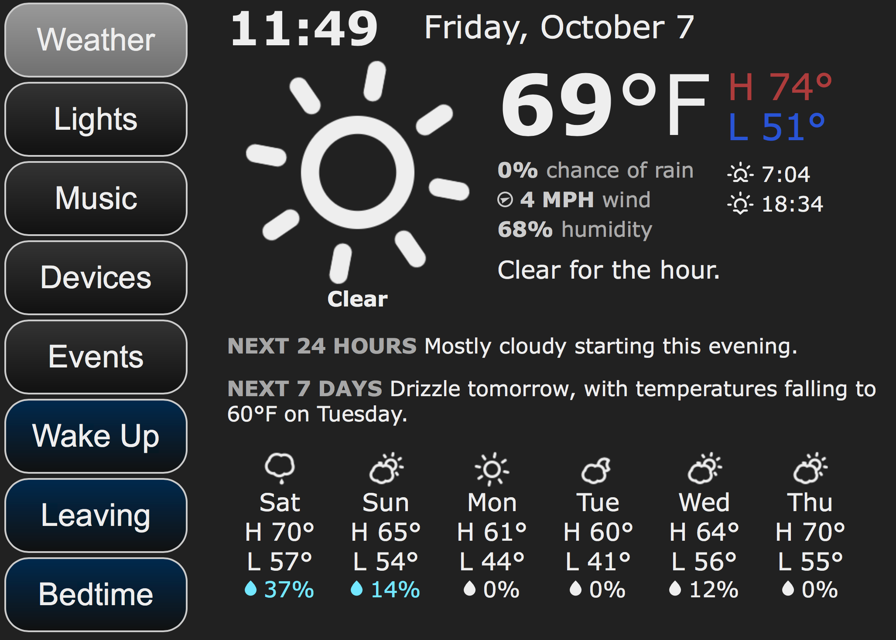

# Dashboard
Dashboard for home automation display and control

### Outline
Ideally this dashboard will provide a modular means of not only displaying useful data (weather, device status) but providing interactivity for home automation including lights/scenes, music (playback and source control) and other things. Building this dashboard in a modular sense should allow complete control over what buttons to display, what they do (load a page, trigger an action) and offer expandability for features beyond what is already present. 

My initial plans are to at least include a weather module (Forecast.io API), support for lights (Philips Hue) and specific scenes, as well as music control (iTunes initially, with support for changing playlists, tracks, volume and AirPlay sources). I have a crude model working for weather and music so far, but nothing is modular at this point. The size has been optimized for running on an iPad Mini display, but I plan to make it more flexible for resizing to different demands. The main goal is for a screen as small as the iPad Mini to be as easy to read from a distance as possible and not be too cluttered as is easy to do. 

So far this project is written in Node.JS using Express and Handlebars, but I'm open to suggestions if these are less than ideal for the scope of this project.

### Components
Components aren't currently written in the most practical modular sense, they are just individual pages loaded by referencing their URL. Ideally this will change to be one page that is loaded along with all components, the buttons will simply change what content is displayed (but already loaded). This should help reduce noticeable lag when changing pages. 

Currently the following components are available:
- Weather
- Music
- Lights

More are planned, and any ideas for more are welcome (this is mostly just based on what I use regularly)

The buttons on the left will eventually be modular, with a visual differentiator for pages vs actions (currently the bottom 3 with blue indicators are for scene triggers). Action buttons are intended to trigger scenes, respective to whatever platform can be tied in. Scenes ideally will not be limited just to light scenes but rather include a spectrum of devices that all trigger with the same scene. 

### Functionality
The dashboard pictured above is the current incarnation but will likely evolve. Based on the current design, the buttons on the left work as such:
- Buttons with a white to black gradient (top buttons) change the content on the right
- Button with a blue to black gradient trigger actions, meaning the content on the right stays the same but a "scene" will activate on push. The intention is to have a handful of regularly used scenes ready to push at all times
- Eventually the buttons will be swappable with a configuration to define the name, type (page/scene) and call (trigger page/scene)

While the content on the right will eventually be modular, at the moment they are static pages and content refreshes typically happen as a page reload. Ideally this will all be loaded once at initial page load, then refreshes will occur behind the scenes and update using AJAX or something. This should make sure the UI is more smooth without refresh blips or noticeable page changes. It also should help keeping other pages up to date before you open them, for things like music or device states (lights on/off etc). 

#### Weather
Weather functionality works using a custom front-end with help from [Forecast](https://github.com/jameswyse/forecast), combined with [Skycons](https://github.com/darkskyapp/skycons) for animated weather icons and [Weather Icons](https://erikflowers.github.io/weather-icons/) for wind bearing. Some changes will likely be made to closer mimic the Dark Sky 24-hour weather bar for easier visibility of the day. Only required inputs are API Key and location data.

#### Music
Thanks to [iTunes-Remote](https://github.com/Siddharth11/iTunes-Remote/) the music page has superior functionality than before. This module allows it to interface to an existing iTunes instance and display what is playing, change volume, tracks and playlists. I am hoping to add an interface to AirPlay sources as well, allowing you to see which ones are currently enabled/available and toggle as many as needed, as well as change volume individually (may be trickier). Based on iTunes Remote's design, this seems fairly easy to implement using the AppleScript interface it already ties to. I don't personally have plans to extend this beyond iTunes, but ideas are welcomed.

#### Lights
This hasn't been fully implemented yet, but I plan to focus primarily on Philips Hue lights as they are what I am most familiar with from an API perspective. At the very least I intend to have this page display a list of lights and their state/color with the ability to toggle any of those settings. Scenes are a bit messy in the Hue API but may be implemented systematically, otherwise they may need to be added manually to ensure you only display the ones you want (rather than 20+ that may not be necessary).

#### Devices
This hasn't been fully thought out yet, at the moment its just a sort of dumping ground for any other devices, since I couldn't justify entire buttons for one or two components of a type (cameras, sensors, etc). Again, ideally this will end up all being modular anyway, so this page may not be necessary but it is intended as a quick means to see other devices quickly.

#### Events
This also may not be as important on this style dashboard, so it may get buried elsewhere (still looking into menus that slide out from the edges) but the idea is to log events that occur either on this dashboard, or potentially by tying into logging from other services (Home Assistant, etc). This would be mostly useful for troubleshooting but could be helpful to see if an alarm was sounded, etc.

#### Wake up/Leaving/Bedtime
These buttons are intended to be actions/scenes. Some example use cases could be as simple as triggering light scenes, or as complex as full actions like "wake up" turning on a specific light scene, turning on a switch to say, the coffee maker, disabling the alarm system/camera, turning on the morning news all at once. "Leaving" could do some of the opposite, when you leave the house it could be a means to arm the alarm/camera, turn on/off certain lights, etc and is also intended as a toggle that changes to "Arriving" after triggered, ready for actions related to arrival. "Bedtime" may trigger a scene that turns off most of the house lights except the bedroom and hall lights, while arming alarm/camera, etc. 
